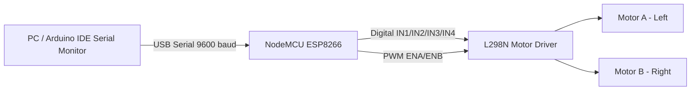
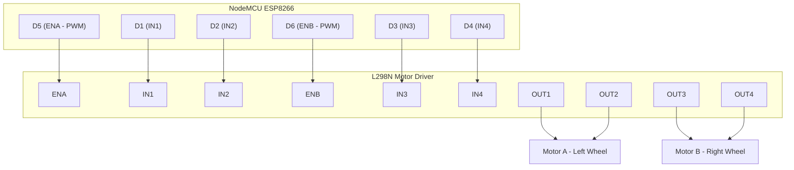

# ESP8266 Serial-Controlled Robot Car

A simple two-motor robot car built on a **NodeMCU (ESP8266)** board and an **L298N motor driver**, controlled by sending single-character commands (`F`, `B`, `L`, `R`, `S`) over a Serial connection.

---

## Overview

This project is a beginner-to-intermediate level embedded systems build that demonstrates basic motor control using an ESP8266 microcontroller. The car moves forward, backward, turns left/right, and stops based on commands typed into the Arduino IDE's Serial Monitor. It's a foundational project that can later be extended into a Bluetooth-, WiFi-, or app-controlled robot.

---

## Features

- Directional control: Forward, Backward, Left turn, Right turn, Stop
- Single-character command protocol (`F` / `B` / `L` / `R` / `S`)
- Real-time feedback printed to Serial Monitor (e.g. `Moving FORWARD`, `STOPPED`)
- Full-speed PWM drive via `analogWrite()` (10-bit range on ESP8266)
- Simple, breadboard-friendly wiring — easy to replicate or modify
- Compact chassis with two motors + a caster/support wheel for balance

---

## Components Used

| Component | Quantity | Purpose |
|---|---|---|
| NodeMCU (ESP8266) | 1 | Main microcontroller |
| L298N Motor Driver Module | 1 | Drives both DC motors (H-Bridge) |
| DC Geared Motors | 2 | Wheel drive |
| Robot Chassis (wood/acrylic board) | 1 | Mounting platform |
| Wheels | 2 (+ 1 caster/support wheel) | Movement |
| Jumper Wires (M-M / M-F) | Multiple | Connections |
| Perfboard/Breadboard | 1 | Mounting NodeMCU and routing wires |
| USB Cable | 1 | Power + Serial communication with PC |
| Power Source (battery pack) | 1 | Powers motor driver / motors |

---

## System Architecture



The PC sends a command character over USB Serial. The ESP8266 reads it, decides the direction/state, and drives the L298N's input pins (direction) and enable pins (speed via PWM), which in turn power the two DC motors.

---

## Circuit Diagram



**Pin mapping reference:**

| NodeMCU Pin | GPIO | L298N Pin | Function |
|---|---|---|---|
| D5 | GPIO14 | ENA | Motor A speed (PWM) |
| D1 | GPIO5 | IN1 | Motor A direction |
| D2 | GPIO4 | IN2 | Motor A direction |
| D6 | GPIO12 | ENB | Motor B speed (PWM) |
| D3 | GPIO0 | IN3 | Motor B direction |
| D4 | GPIO2 | IN4 | Motor B direction |

> **Note:** D3 (GPIO0) and D4 (GPIO2) are ESP8266 boot-mode strapping pins. Avoid pulling them low externally at power-up, or the board may fail to boot correctly.

---

## Working Principle

1. The ESP8266 initializes Serial communication at 9600 baud and sets all motor control pins as outputs.
2. A command character (`F`, `B`, `L`, `R`, or `S`) is sent from the Serial Monitor.
3. The `loop()` reads the incoming byte, converts it to uppercase, and matches it in a `switch` statement.
4. Based on the matched command, the corresponding function (`forward()`, `backward()`, `leftTurn()`, `rightTurn()`, `stopMotor()`) sets the `IN1–IN4` pins HIGH/LOW to control motor direction through the L298N's H-Bridge.
5. `analogWrite()` on `ENA`/`ENB` supplies PWM signal (full speed = 1023 on ESP8266's 10-bit PWM) to control motor speed.
6. Turning is achieved by spinning the two motors in opposite directions (differential drive), while forward/backward drives both motors the same direction.
7. Any unrecognized character prints `Invalid Command!` without changing motor state.

---

## Software Requirements

- **Arduino IDE** (2.x recommended)
- **ESP8266 Board Package** installed via Arduino IDE Boards Manager
  (Board selected: *NodeMCU 1.0 (ESP8266-12E Module)* or equivalent)
- **Serial Monitor** (built into Arduino IDE) set to **9600 baud**
- No external libraries required — the code uses only built-in `Serial`, `pinMode`, `digitalWrite`, and `analogWrite` functions

---

## Code

Full source code: [`robot_car.ino`](./robot_car.ino)

```cpp
// Motor A pins
int ENA = D5;   // GPIO14
int IN1 = D1;   // GPIO5
int IN2 = D2;   // GPIO4
// Motor B pins
int ENB = D6;   // GPIO12
int IN3 = D3;   // GPIO0
int IN4 = D4;   // GPIO2

void setup() {
  Serial.begin(9600);
  pinMode(ENA, OUTPUT);
  pinMode(IN1, OUTPUT);
  pinMode(IN2, OUTPUT);
  pinMode(ENB, OUTPUT);
  pinMode(IN3, OUTPUT);
  pinMode(IN4, OUTPUT);
  Serial.println("Send Command: F,B,L,R,S");
}

// See robot_car.ino for full movement functions and main loop
```

---

## Installation and Setup

1. **Install Arduino IDE** from [arduino.cc](https://www.arduino.cc/en/software).
2. **Add ESP8266 board support**:
   - Go to `File > Preferences` → add this URL to *Additional Board Manager URLs*:
     `http://arduino.esp8266.com/stable/package_esp8266com_index.json`
   - Go to `Tools > Board > Boards Manager` → search `esp8266` → install.
3. **Select the board**: `Tools > Board > NodeMCU 1.0 (ESP8266-12E Module)`
4. **Select the correct COM port** under `Tools > Port`.
5. **Wire the circuit** as per the [Circuit Diagram](#circuit-diagram) above.
6. **Open `robot_car.ino`** in the Arduino IDE.
7. **Upload the code** to the NodeMCU.
8. **Open the Serial Monitor**, set baud rate to `9600`.
9. **Send commands**: type `F`, `B`, `L`, `R`, or `S` and hit enter to control the car.

---

## Project Structure

```
ESP8266-Serial-Controlled-Robot-Car/
│
├── robot_car.ino        # Main Arduino/ESP8266 source code
├── README.md            # Project documentation (this file)
└── images/              # Photos/media of the hardware build
    ├── robot.jpeg
    └── robot_demo.mp4
```

---

## Applications

- Educational demonstration of embedded systems and motor control
- Base platform for line-following, obstacle-avoidance, or maze-solving robots
- Starting point for Bluetooth/WiFi/app-controlled RC cars
- STEM teaching aid for basic robotics and IoT concepts

---

## Future Enhancements

- Add **Bluetooth (HC-05)** or **WiFi-based** control (e.g., a web page or mobile app) instead of wired Serial
- Add **variable speed control** (send a number along with the direction command)
- Add **obstacle avoidance** using an ultrasonic sensor (HC-SR04)
- Add a **command timeout/watchdog** so motors auto-stop if connection is lost
- Add **line-following sensors** (IR sensor array) for autonomous navigation
- Power the system from an **onboard battery pack** for fully wireless operation
- Filter out `\n`/`\r` characters in Serial input to avoid false "Invalid Command!" prints

---

## Conclusion

This project demonstrates the fundamentals of interfacing a microcontroller with a motor driver to build a functional, serially-controlled robot car. It provides a solid base for more advanced robotics projects involving wireless control, sensors, and autonomous navigation.

---

## Author

**Parth A. Bapat**
B.Sc. Computer Science Student | Embedded Systems & IoT Enthusiast
