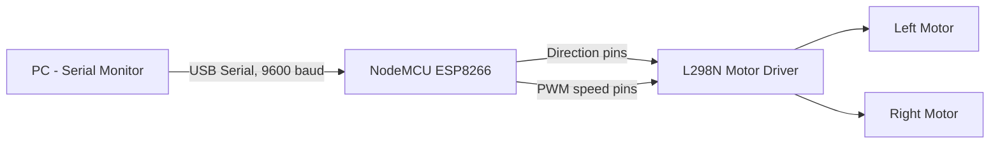
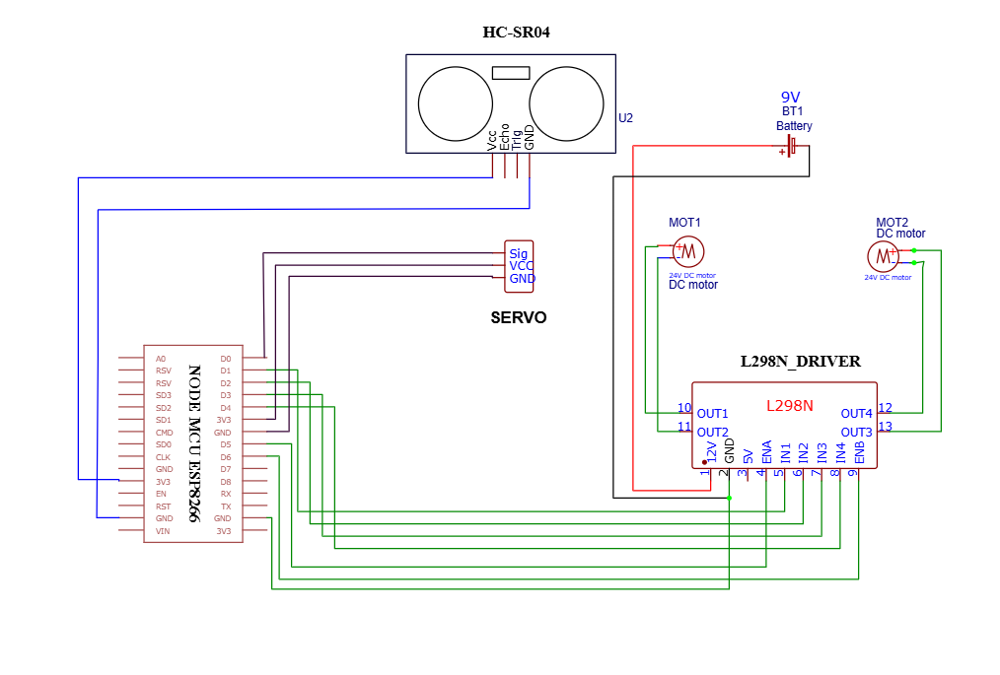

# ESP8266 Serial-Controlled Robot Car

A two-motor robot car built around a NodeMCU (ESP8266) and an L298N motor driver, controlled through simple serial commands (`F`, `B`, `L`, `R`, `S`). I built this as a foundational embedded systems project to practice motor control, PWM-based speed regulation, and serial communication before extending it into wireless or sensor-driven versions.

---

## Overview

This project focuses on the fundamentals: driving two DC motors through an H-bridge driver, controlling direction and speed from a microcontroller, and structuring a clean command-based control scheme. I deliberately kept the first version wired (USB Serial) rather than wireless, so I could verify the core motor control logic worked reliably before adding any communication layer on top of it.

The chassis is a wooden board I cut and drilled myself, with two driven wheels and a caster wheel for support at the front.

---

## Features

- Directional control: forward, backward, left turn, right turn, stop
- Command-driven control via single-character serial input
- Real-time status feedback printed to the Serial Monitor for debugging
- Full-speed PWM output on both motors (10-bit resolution, ESP8266-specific)
- Compact, breadboard-friendly wiring suitable for prototyping

---

## Components Used

| Component | Qty | Purpose |
|---|---|---|
| NodeMCU (ESP8266) | 1 | Main microcontroller |
| L298N Motor Driver | 1 | Drives both DC motors via H-bridge |
| DC Geared Motors | 2 | Wheel drive |
| Wooden chassis | 1 | Mounting platform for all components |
| Wheels + 1 caster wheel | 3 | Two drive wheels, one support wheel |
| Jumper wires | Several | Connections between NodeMCU, driver, and motors |
| Perfboard | 1 | Mounting the NodeMCU and routing connections |
| USB cable | 1 | Power, programming, and serial communication |
| Battery pack | 1 | Powers the motor driver and motors independently |

---

## System Architecture

The control flow is straightforward: a command is sent from a PC over Serial, the NodeMCU interprets it, and the L298N drives the motors accordingly.



There is no wireless or cloud component in this version — control is entirely local, over a wired serial connection.

---

## Circuit / Wiring

Pin connections between the NodeMCU and the L298N driver:

| NodeMCU Pin | GPIO | L298N Pin | Function |
|---|---|---|---|
| D5 | GPIO14 | ENA | Speed control, left motor |
| D1 | GPIO5 | IN1 | Direction control, left motor |
| D2 | GPIO4 | IN2 | Direction control, left motor |
| D6 | GPIO12 | ENB | Speed control, right motor |
| D3 | GPIO0 | IN3 | Direction control, right motor |
| D4 | GPIO2 | IN4 | Direction control, right motor |

**Note:** D3 (GPIO0) and D4 (GPIO2) are ESP8266 boot-mode strapping pins. If they are pulled low during power-up, the board may fail to boot correctly — worth checking first if the board behaves unexpectedly on startup.




---

## Working Principle

1. On startup, the NodeMCU initializes Serial communication at 9600 baud and configures all six motor-control pins as outputs.
2. The main loop continuously checks for incoming serial data.
3. Each incoming character is converted to uppercase and matched against a switch statement, so commands are case-insensitive.
4. Based on the match, one of five functions executes: `forward()`, `backward()`, `leftTurn()`, `rightTurn()`, or `stopMotor()`.
5. Each function sets the IN1–IN4 pins HIGH/LOW in a specific pattern, which determines current flow direction through the H-bridge and, consequently, motor direction.
6. Turning is achieved by driving the two motors in opposite directions rather than the same direction, producing a pivot rather than a straight-line move.
7. Speed is currently fixed at maximum output (1023), since the ESP8266's PWM resolution is 10-bit (0–1023), unlike the 8-bit (0–255) range used on standard Arduino boards.
8. Any character outside the defined command set is ignored and logged as `Invalid Command!` without affecting motor state.

---

## Software Requirements

- Arduino IDE (2.x recommended)
- ESP8266 board package, installed via Boards Manager (`esp8266` search)
- Board setting: NodeMCU 1.0 (ESP8266-12E Module)
- Serial Monitor configured to 9600 baud
- No external libraries required — the code relies only on built-in `Serial`, `pinMode`, `digitalWrite`, and `analogWrite` functions

---

## Code

Full source: 
[robot_car.ino](./robot_car.ino)

The complete implementation, including the movement functions and main loop, is available in the `.ino` file.

---

## Installation and Setup

1. Install the Arduino IDE.
2. Add ESP8266 board support: `File > Preferences`, then add this URL under "Additional Board Manager URLs":
   `http://arduino.esp8266.com/stable/package_esp8266com_index.json`
3. Go to `Tools > Board > Boards Manager`, search for `esp8266`, and install the package.
4. Select the board: `Tools > Board > NodeMCU 1.0 (ESP8266-12E Module)`.
5. Connect the NodeMCU and select the correct port under `Tools > Port`.
6. Wire the circuit according to the pin table above.
7. Open `robot_car.ino` in the Arduino IDE and upload it.
8. Open the Serial Monitor and set the baud rate to 9600.
9. Send `F`, `B`, `L`, `R`, or `S` to control the car.

---

## Project Structure

```
ESP8266-Serial-Controlled-Robot-Car/
│
├── robot_car.ino     # Main source code
├── README.md         # Project documentation
└── images/           # Photos and demo video of the build
```

---

## Applications

- Demonstrates fundamental embedded systems concepts: motor control, PWM, and serial communication
- Serves as a base platform for line-following, obstacle-avoidance, or maze-solving robots
- Can be extended into a Bluetooth-, WiFi-, or app-controlled RC car
- Useful as a teaching example for basic robotics and IoT concepts

---

## Future Enhancements

- Replace wired Serial control with Bluetooth (HC-05) or WiFi for remote operation
- Add variable speed control instead of fixed full-speed output
- Integrate an ultrasonic sensor (HC-SR04) for obstacle avoidance
- Add a command timeout/watchdog so motors stop automatically if the connection is lost
- Add IR sensors for autonomous line-following
- Move to fully battery-powered operation, independent of USB

---

## Conclusion

This project reinforced my understanding of how a microcontroller interfaces with a motor driver to achieve controlled movement — covering H-bridge direction control, PWM-based speed regulation, and serial command parsing. It's a compact but complete foundation that I plan to build on for more advanced robotics work involving wireless control and sensor integration.

---

## Acknowledgements

This project was built during my internship at Learnalytics Tech Academy Pvt. Ltd., 
under the guidance of Mr.Atul Borkar Sir[Learnalytics Tech Academy Pvt. Ltd.] . Their support and feedback during the 
development process were valuable in building this project.

---
